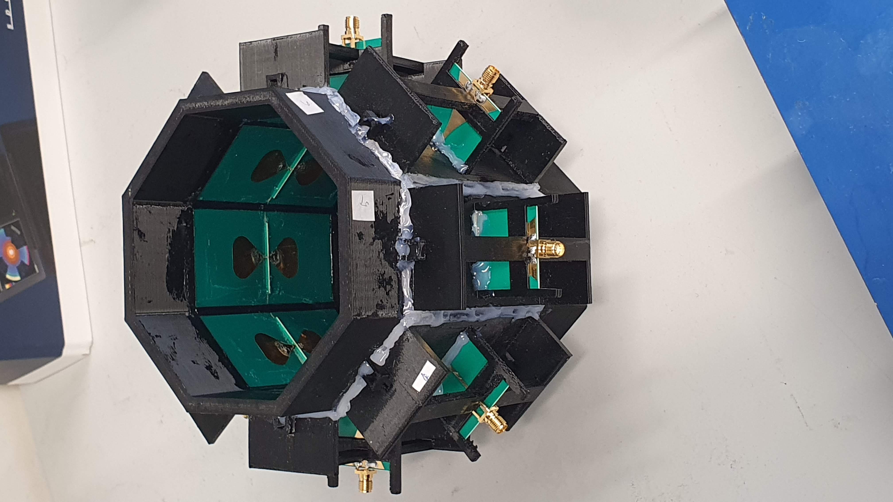
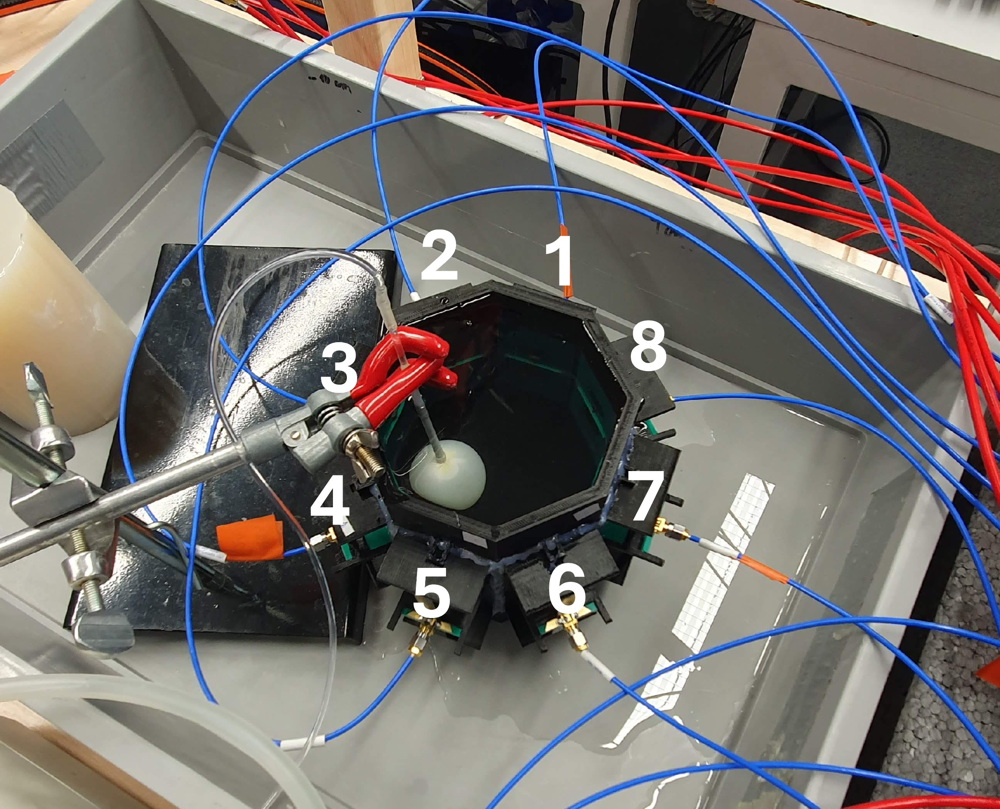
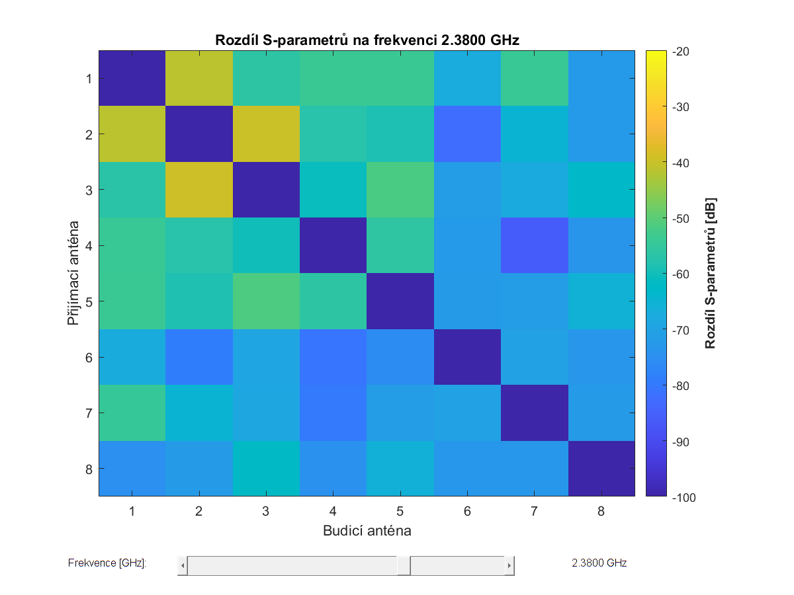
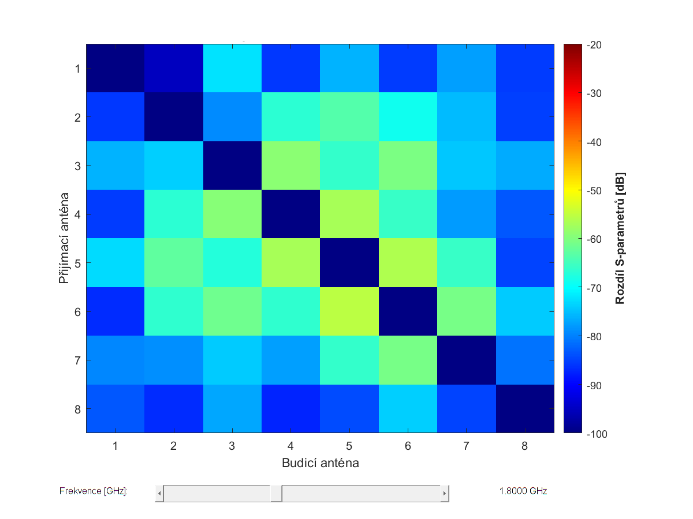
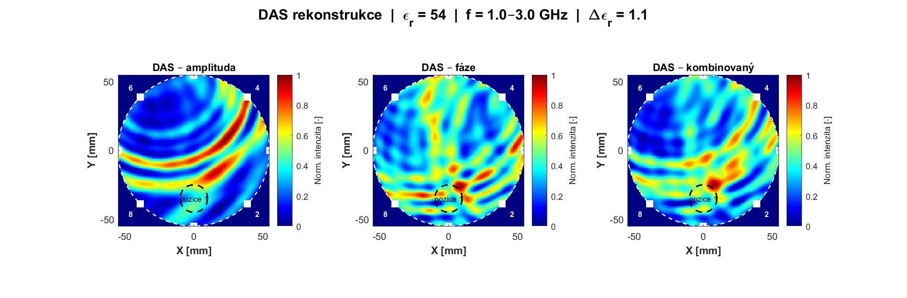
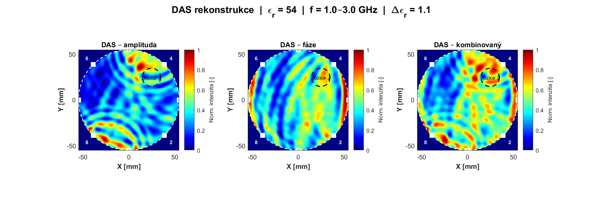

# UWB Antenna System for Non-Invasive Microwave Thermometry

Master's thesis project (CTU Prague, Faculty of Electrical Engineering) — the design, fabrication, and experimental validation of an 8-element ultra-wideband (UWB) antenna array for non-invasive microwave thermometry during hyperthermia cancer treatment.

> Full thesis (defended May 2026, graduated with honors) is held by CTU Prague and is not reproduced here in full. This repository presents a portfolio summary, selected figures/results, and supporting code and measurement data.

## Overview

Hyperthermia treatment heats tumor tissue to improve the effectiveness of radio/chemotherapy, but requires precise real-time temperature monitoring to stay safe and effective. This project explores a non-contact alternative to invasive temperature probes: an antenna array that detects the tiny changes in tissue dielectric properties that occur as tissue temperature rises, using UWB radar principles.

**Pipeline covered end-to-end:**
1. **Design & simulation** — bow-tie antenna elements and a balun (symmetrizing feed) designed and optimized in Sim4Life (FDTD method), operating across 1–3 GHz.
2. **Fabrication** — antenna elements manufactured via PCB technology; supporting structures and the measurement vessel 3D-printed in PETG.
3. **Phantom preparation** — solid (agar) and liquid tissue-mimicking phantoms prepared at two dielectric states corresponding to physiological temperature (37 °C) and hyperthermic heating (44 °C).
4. **Measurement** — S-parameters of the 8-element array measured on a vector network analyzer (VNA) with a switching matrix, with a small balloon target moved through the phantom to simulate a localized dielectric change.
5. **Signal processing** — differential S-parameter analysis and a Delay-and-Sum (DAS) beamforming algorithm used to spatially localize the simulated dielectric anomaly.

## Result

The system successfully detected the induced dielectric contrast, and the DAS-processed data produced an approximate spatial localization of the target anomaly — demonstrating that the array generates data usable for image reconstruction, i.e. a working proof of concept for image-based non-invasive thermometry. Identified limitations (3D-print watertightness, fabrication-tolerance effects on impedance matching) are documented along with recommended next steps (more array elements, improved vessel sealing).

## Results in detail

### Antenna array hardware

| Assembled 8-element array | Measurement setup with heating target |
|---|---|
|  |  |

The 8 bow-tie antenna elements are mounted around an octagonal 3D-printed vessel and connected via SMA connectors to the switching matrix. The right-hand photo shows the setup used to simulate a localized heated region: a balloon filled with a higher-dielectric-contrast liquid is inserted into the phantom at a known position (here between antennas 3 and 4) to mimic tissue undergoing hyperthermic heating.

### S-parameter differential analysis

Before running the imaging algorithm, the frequency band with the strongest response to the simulated heating was identified by comparing S-parameter matrices between the baseline (37 °C) and heated (44 °C) phantom states across the full 1–3 GHz sweep.

| Target position 1, 2.38 GHz | Target position 4, 1.8 GHz (strongest response) |
|---|---|
|  |  |

Each cell shows the magnitude difference (in dB) between the two states for a given transmit/receive antenna pair. Brighter (yellow/green) cells indicate antenna pairs whose signal path is most affected by the dielectric change — i.e. pairs whose line of sight passes near the heated region. This scan across frequencies is what determines the antenna-pair weighting used in the DAS reconstruction below.

### DAS image reconstruction

The final step combines the differential amplitude and phase data, weighted by pair sensitivity, into a spatial image of the dielectric anomaly using delay-and-sum (DAS) beamforming.

| Target position 1 | Target position 4 |
|---|---|
|  |  |

Each figure shows three reconstructions from the same measurement — amplitude-only, phase-only, and combined — plotted over the physical array geometry (antenna positions marked as white squares, numbered 1–8). The dashed circle marks the actual (known) location of the simulated heated region. The phase-based and combined reconstructions show a localized intensity peak near the true target position, consistent with the thesis's conclusion that phase information is more sensitive than amplitude to the small dielectric contrast used in this experiment.

## Repository contents

- [`docs/`](docs) — selected figures from the thesis (simulation results, fabrication photos, measurement setup, key plots)
- [`code/`](code) — MATLAB post-processing and visualization scripts (see below)
- [`data/`](data) — measurement data *(added incrementally)*

## Code

### Simulation post-processing (Sim4Life exports)

These scripts read Sim4Life exports (`.csv` / `.mat`) selected via a file picker and produce the plots used for the simulation chapters of the thesis.

| Script | Purpose |
|---|---|
| [`plot_sweep_comparison.m`](code/plot_sweep_comparison.m) | Overlays multiple S-parameter sweep CSVs on one plot with 1/3 GHz and -10 dB reference lines |
| [`plot_final_model_s11.m`](code/plot_final_model_s11.m) | Plots the S11 reflection coefficient of the final antenna model |
| [`plot_reflection_and_impedance.m`](code/plot_reflection_and_impedance.m) | Auto-sorts CSV columns into separate reflection-coefficient and input-impedance plots |
| [`plot_simulations_select_best.m`](code/plot_simulations_select_best.m) | Loads a batch of parametric-sweep simulations, scores each by resonance depth/smoothness, and highlights the best-performing design |
| [`plot_individual_antenna_simulations.m`](code/plot_individual_antenna_simulations.m) | Parses per-iteration parameter labels from CSV headers and plots each simulation run in its own window |
| [`plot_dielectric_properties.m`](code/plot_dielectric_properties.m) | Plots frequency-dependent relative permittivity and conductivity for the tissue phantoms |
| [`plot_em_field_slices.m`](code/plot_em_field_slices.m) | Rasterizes an XZ slice of the simulated E-field (real, imaginary, and RMS components) from a Sim4Life `.mat` export |
| [`plot_sar_slice.m`](code/plot_sar_slice.m) / [`find_sar_max_values.m`](code/find_sar_max_values.m) | Two variants of an XZ SAR-distribution slice plot; the latter auto-locates and reports the global SAR maximum |

### Measured-data analysis (VNA measurements, `data/`)

These scripts load the raw VNA S-parameter measurements in [`data/`](data) and process them into the diagnostic and reconstruction results presented in the measurement chapter.

| Script | Purpose |
|---|---|
| [`inspect_mat_structure.m`](code/inspect_mat_structure.m) | Recursively inspects a `.mat` file's field structure — the first step for understanding a new measurement export |
| [`plot_s_parameters.m`](code/plot_s_parameters.m) | Plots all 8 reflection coefficients (S11-S88) plus a full 8x8 grid of transmission terms (Sij) |
| [`find_resonance.m`](code/find_resonance.m) | Detects system-wide resonances across the full 8x8 S-matrix using three independent metrics (mean of all Sij, mean of transmission-only Sij, and dominant SVD singular value), then cross-checks agreement between methods |
| [`diff_analysis_interactive.m`](code/diff_analysis_interactive.m) | Interactive slider tool comparing two measurement states (e.g. T37 vs. T44) across frequency, showing the full Sij difference matrix as a heatmap |
| [`DAS_reconstruction.m`](code/DAS_reconstruction.m) | Core imaging algorithm: computes amplitude and phase differences between a baseline and heated measurement, weights antenna pairs by sensitivity, and reconstructs a 2D spatial image of the dielectric anomaly via delay-and-sum beamforming |
| [`plot_phantom_uncertainty.m`](code/plot_phantom_uncertainty.m) | Computes Type A/B/C measurement uncertainty (per GUM methodology) for the phantom's dielectric probe measurements and plots the mean curve with its uncertainty band |

## Data

[`data/`](data) contains the raw 8-port VNA S-parameter measurements (`.mat`, ~600 KB each) used by the scripts above. File naming: `pos{N}_T{temp}[_v2].mat`

- **`pos1` / `pos4`** — position of the simulated heated region relative to the antenna array
- **`T37` / `T44`** — phantom dielectric state, corresponding to physiological (37°C) vs. hyperthermic (44°C) tissue temperature
- **`_v2`** — repeated measurement run

Each file contains an 8x8xN complex S-parameter matrix (`data.measurement.s_mat`) and the corresponding frequency vector (`data.info.freqVect`).

## Tools & technologies

Sim4Life (FDTD EM simulation) · PCB fabrication · 3D printing (PETG) · Vector Network Analyzer measurement · MATLAB/Python (DAS signal processing)

## Author

Matej Dynda — [LinkedIn](https://linkedin.com/in/matej-dynda)
Supervisor: Prof. Ing. Jan Vrba, CSc. — Department of Electromagnetic Field, CTU Prague
